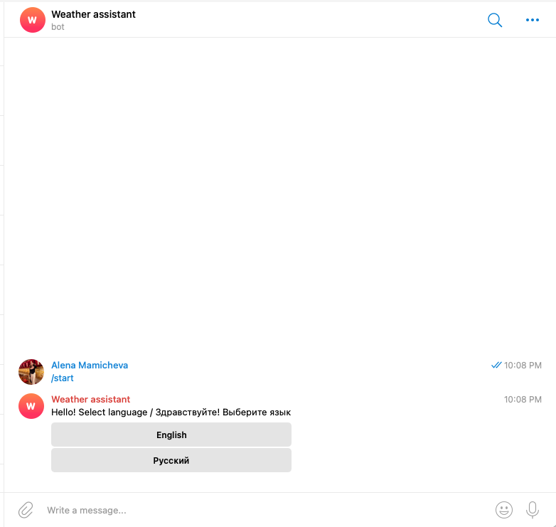
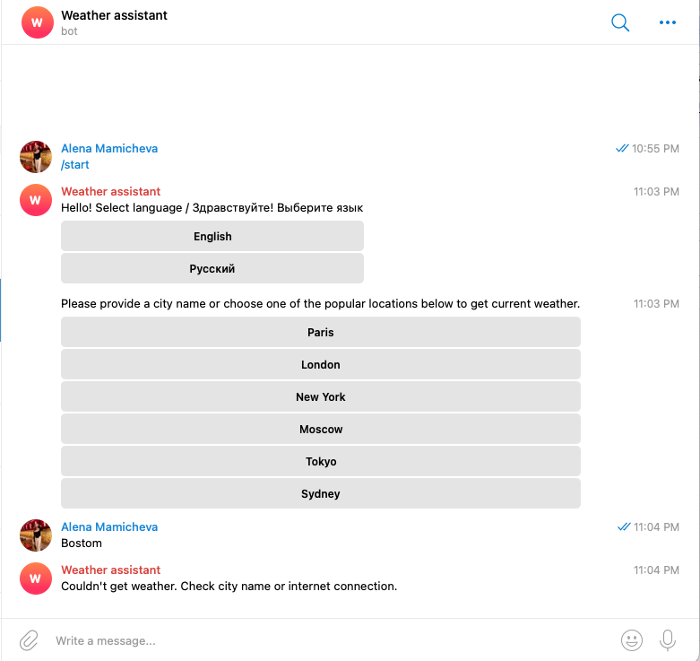
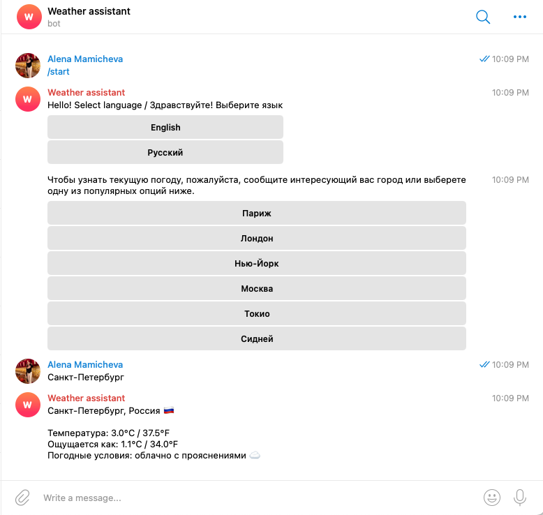
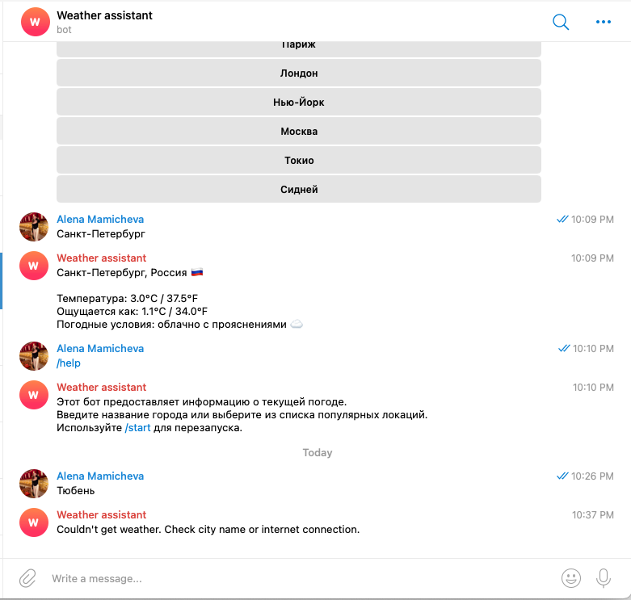

# Weather Assistant Telegram Bot

Production-ready Telegram bot that provides real-time weather data worldwide using OpenWeather API.

## Features

• Real-time weather lookup
• City search worldwide 
• Bilingual interface (EN/RU)
• Error handling  
• FSM conversation flow  
• API integrations

## Tech Stack

Python  
python-telegram-bot  
REST APIs  
Render deployment  
GitHub CI workflow  

## Architecture

User

 ↓

Telegram Bot

 ↓

Handlers

 ↓

Services

 ↓ 

Weather API

Project structure:

core/

    weather_service.py
    models.py
    errors.py

tg_bot/

    handlers.py
    keyboards.py
    state.py
    texts.py

data/

    cities500.txt

main.py

## Deployment

Hosted on Render cloud platform.

## Environment variables

BOT_TOKEN=

WEATHER_API_KEY=

GEONAMES_USERNAME=

## How to run locally

pip install -r requirements.txt  
python main.py

## Live Demo

Try the bot:
https://t.me/Weatherweather_bot_weather_bot

## Screenshots

### Start menu
User selects preferred language and can choose one of the popular options.

 

### Weather lookup example
User searches for Paris weather.
 

### Error handling
User mistypes the requested city.
 

### Russian version
 

## Future improvements

• Docker deployment  
• PostgreSQL storage  
• Webhook mode  
• Caching layer

## Author

Alena – Python developer focused on automation and Telegram bots.